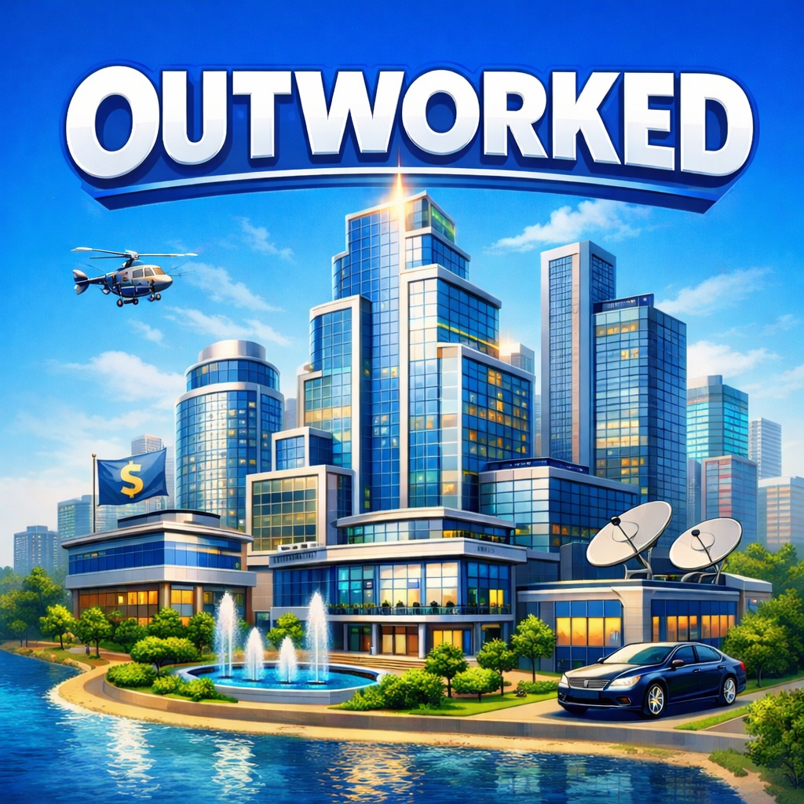

<p align="center">
  
</p>

<h1 align="center">Outworked</h1>

<p align="center">
  <strong>Outworked is a desktop app that turns Claude into a team of AI employees.<br/>
  Hire agents. Give them roles. Watch them write code, interact with the web, send messages,<br/>
  and run scheduled tasks — all from an office on your Mac.</strong>
</p>
<p align="center">
  <em>No API keys. No config. Just your Claude Code subscription and a can-do attitude!</em>
</p>

<p align="center">
  <a href="https://github.com/outworked/outworked/releases/download/v0.3.0/Outworked-0.3.0-arm64.dmg">
    
  </a>
</p>

<p align="center">
  <a href="https://github.com/outworked/outworked/releases"></a>
  <a href="LICENSE"></a>
  
</p>

---

<p align="center">
  
</p>

---

<p align="center">
  <a href="https://github.com/outworked/outworked/releases/"><strong>Download</strong></a> ·
  <a href="#how-it-works"><strong>How It Works</strong></a> ·
  <a href="#example-workflows"><strong>Examples</strong></a> ·
  <a href="#capabilities"><strong>Capabilities</strong></a> ·
  <a href="#features"><strong>Features</strong></a> ·
  <a href="#skills"><strong>Skills</strong></a> ·
  <a href="#mcp-servers"><strong>MCP Servers</strong></a> ·
  <a href="#channels--scheduling"><strong>Channels</strong></a>
</p>

---

## How It Works

1. **Hire agents** — Give each one a name, role, personality, model, and sprite
2. **Describe a goal** — Write what you want in plain English; the orchestrator breaks it into subtasks and routes them to the right agents automatically
3. **Watch them work** — Agents walk to their desks, write code, interact with the web, send messages, run scheduled jobs — all visible in the office
4. **Ship it** — Just let your agents handle the whole workflow end to end

---

## Example Workflows

These are real things you can do today, not a roadmap. (probably)

### "Build me a landing page and send it to my cofounder"

> You type one sentence. Here's what happens:

1. The orchestrator breaks it into subtasks and assigns them across your team
2. **Frontend Dev** scaffolds the site, writes the HTML/CSS/JS, and starts a local server
3. **Designer** reviews the page in the built-in browser, takes a screenshot, and asks Frontend Dev to tweak the spacing
4. Frontend Dev makes the fix, then runs `tunnel_start` to get a public URL
5. Frontend Dev calls `send_message` to text the link to your cofounder on iMessage

You watched the whole thing happen at the office. You are wowed. Your cofounder gives you more equity. Total prompts from you: **1**.

### "Every morning at 9am, check our open PRs and text me a summary"

1. You tell your **Ops Agent** to set up a daily task
2. The agent creates a scheduled trigger with a cron expression (`0 9 * * *`)
3. Every morning, the agent wakes up, queries the GitHub MCP server for open PRs, writes a summary, and sends it to you via iMessage
4. You read it on your phone over coffee

No scripts to maintain. No GitHub Actions to debug. Just an agent with a schedule.

### "Research these three competitor products and write up a comparison"

1. The orchestrator assigns a **Researcher** agent to each competitor — all three run in parallel
2. Each agent uses the built-in browser to navigate the competitor's site, read docs, take screenshots, and extract pricing
3. A **Writer** agent collects all three findings, writes a structured comparison doc, and commits it to your repo
4. The Writer asks if you want it sent to Slack — you approve, and it posts to #product

Three agents working simultaneously, finishing in minutes what would take you probably weeks.

### "Triage the 12 new GitHub issues from last night"

1. **Project Manager** agent pulls all new issues via the GitHub MCP server
2. It reads each one, labels by priority and type, assigns to the right team member, and adds a first response comment
3. For any bug it can reproduce, it assigns a **Backend Engineer** agent to investigate and open a draft PR with a fix
4. You get a Slack summary of what was triaged, what's in progress, and what needs your attention
5. You lay off the whole office with impunity

### "Post to LinkedIn 13 times a day"

1. **LinkedIn Guru** agent looks at LinkedInLunatics
2. It uses the posts as inspiration
3. It posts them on your behalf every hour using its built in browser
4. ???
5. Profit

---

## Capabilities

**Write and ship code** — Build features, fix bugs, open PRs, review each other's work, run tests, and deploy — across multiple repos at once.

**Browse the web** — Research docs, scrape pages, fill out forms, take screenshots, and bring findings back to the team via the built-in browser.

**Send and receive messages** — Reply to customers on Slack, text you a summary on iMessage, or monitor a channel and trigger tasks when someone says the magic word.

**Run on a schedule** — Daily standups, weekly reports, hourly health checks, one-off reminders. Set a cron and let an agent handle it while you sleep.

**Query databases** — Connect a PostgreSQL MCP server and let agents run queries, generate reports, or investigate production issues without you writing SQL.

**Manage projects** — Create and triage GitHub issues, update Linear tickets, post status updates to Slack — agents can own the workflow, not just the code.

**Anything you can plug in** — Every MCP server you add gives agents new capabilities. Connect your internal APIs, monitoring dashboards, CMS, or anything with a tool interface. If it exists as an MCP server, your agents can use it.

---

## Features

- **Pixel Office** — A Phaser-powered world where your agents walk, sit at desks, and collaborate in real time
- **Build a Team** — Give each agent a name, role, personality, model, and sprite. Mix Claude Opus for hard problems with Sonnet for fast ones
- **Auto-Orchestration** — Describe a goal; the router breaks it into tasks and assigns them to the right agents
- **Multi-Agent Collaboration** — Agents talk to each other via `[ASK:AgentName]` and a shared message bus
- **Full Claude Code Power** — Every agent gets full tool access (Bash, Edit, Read, etc.) with persistent sessions
- **MCP Server Support** — Connect agents to external tools and services via the Model Context Protocol
- **Messaging Channels** — Connect iMessage and Slack so agents can send and receive messages in real conversations
- **Built-in Browser** — Full Chromium browser for agents to navigate, click, fill forms, and take screenshots
- **Built-in Tunneling** — Expose local servers to the internet via Cloudflare tunnels with a single tool call
- **Triggers & Scheduling** — Fire off agent tasks on a schedule (cron, interval, one-time) or in response to incoming messages
- **Skills System** — Extend agents with plug-in `SKILL.md` files that define tools, auth, and instructions
- **SQLite Storage** — Persistent local database for skills, settings, channels, and message history
- **Permission Gates** — Real-time approval modal for sensitive tool calls
- **Live Chat** — Markdown-rendered conversations with syntax-highlighted code blocks and diffs
- **Built-in Git** — View status, staged changes, branches, and create PRs without leaving the app
- **File Browser** — Live-updating workspace tree that syncs as agents edit files
- **Cost Dashboard** — Track tokens and spend per agent, session, and day
- **Background Mode** — Minimize and let agents keep working. Tray icon keeps you updated
- **Parallel Processing** — Multiple agents tackle subtasks simultaneously
- **Desktop Notifications** — Get pinged when tasks finish or agents need approval
- **Original Soundtrack** — Because every office needs a vibe

---

## Supported Models

| Provider  | Models                     |
| --------- | -------------------------- |
| Anthropic | Any model via Claude Code. |

Each agent can run a different model — pair a fast model for simple tasks with a powerful one for complex work.

---

## Get Started in 2 Minutes

### 1. Install

**Homebrew (recommended)**

```bash
brew tap outworked/tap
brew install --cask outworked
```

**Manual download**

Grab the latest `.dmg` from the [releases page](https://github.com/outworked/outworked/releases) and drag to Applications.

### 2. Prerequisites

- [Claude Code](https://docs.anthropic.com/en/docs/claude-code) installed and authenticated (your existing subscription covers usage — no separate API key needed)

### 3. Launch and Hire Your First Agent

On first launch, the onboarding modal walks you through picking a workspace and creating your first agent. You'll be watching pixel employees do stuff in under two minutes.

### Build from Source

```bash
git clone https://github.com/outworked/outworked.git
cd outworked
npm install
npm run electron:build
```

---

## Scripts

| Command                  | Description                                                                 |
| ------------------------ | --------------------------------------------------------------------------- |
| `npm run dev`            | Start Vite dev server (browser only, no Electron) probably doesnt work      |
| `npm run electron:dev`   | Build and launch the full Electron app in dev mode                          |
| `npm run electron:build` | Package distributable (dmg/zip on macOS, exe on Windows, AppImage on Linux) |

---

## Tech Stack

| Layer    | Technology                           |
| -------- | ------------------------------------ |
| Desktop  | Electron                             |
| Frontend | React 19 + TypeScript + Tailwind CSS |
| Build    | Vite                                 |
| Graphics | Phaser 3                             |
| Storage  | SQLite (better-sqlite3)              |
| AI       | Claude Code SDK                      |

---

## Project Structure

```
src/
├── components/       # React UI (ChatWindow, OfficeCanvas, GitPanel, etc.)
├── lib/              # Core logic (AI, orchestration, tools, storage, costs)
└── phaser/           # Phaser game scene and sprite logic

electron/
├── main.js           # Electron main process (IPC, shell, permissions)
├── preload.js        # Context bridge to renderer
├── sdk-bridge.js     # Claude Code SDK bridge
├── db/               # SQLite database and migrations
├── channels/         # Messaging channels (iMessage, Slack)
├── mcp/              # MCP server management
├── skills/           # Skill runtimes (browser, Gmail, Slack, Notion, etc.)
└── triggers/         # Trigger engine, webhooks, and scheduling

public/
└── music/            # Background music tracks
```

---

## Skills

Outworked uses a `SKILL.md` format — markdown files with YAML frontmatter that define what an agent can do.

```yaml
---
name: my-skill
description: What this skill does
emoji: 🔧
runtime: backend-name # optional — for active skills with a backend
auth:
  type: oauth2 | api-key
  provider: service-name
tools: [tool-1, tool-2]
triggers: [event-type]
---
Instructions and usage docs in markdown...
```

Skills can be **bundled** (ship with the app), **custom** (created in the UI and stored in SQLite), or **dynamic** (loaded at runtime from MCP servers). Mark a skill as global to make it available to every agent, or assign it to specific agents.

**Bundled skills:**

| Skill       | Description                                                     |
| ----------- | --------------------------------------------------------------- |
| Web Browser | Navigate, click, fill forms, screenshot — full Chromium browser |
| Scheduler   | Create and manage scheduled tasks (cron, interval, one-time)    |

More coming soon promise.

---

## MCP Servers

Connect agents to external tools and data sources via the [Model Context Protocol](https://modelcontextprotocol.io).

**Preset servers** (one-click setup):

| Server     | What it provides                           |
| ---------- | ------------------------------------------ |
| GitHub     | Repos, issues, PRs, code search            |
| Filesystem | Read/write access to specified directories |
| PostgreSQL | Query and manage databases                 |
| Slack      | Send and read messages in channels         |
| Linear     | Issues, projects, and workflows            |
| Playwright | Browser automation and testing             |
| Memory     | Persistent key-value storage               |
| Fetch      | HTTP requests to external APIs             |

You can also add **custom MCP servers** (stdio or HTTP) and configure environment variables (API keys, tokens) per server.

---

## Channels & Scheduling

### Channels

Channels connect agents to messaging platforms. Supported channel types:

- **iMessage** — Send and receive messages via phone number or email
- **Slack** — Send and receive messages in Slack channels and threads - next release though

Agents interact with channels through built-in tools: `send_message`, `list_channels`, and `read_channel_messages`. Configure allowed senders to control who can reach your agents.

You can also inject special system prompts for each channel, so that certain inbound messages get a different response than others.

### Scheduling

Ask an agent to schedule a task or run a task on a schedule.

---

## Built-in Browser

Every agent has access to a full browser — not a headless scraper, a real Chromium window managed by the app. It can even open instagram and slack off - just like us.

Agents can **navigate pages, click elements, fill forms, run JavaScript, and take screenshots** using a set of `browse:*` tools. The browser returns an interactive snapshot of every element on the page with its CSS selector, so agents don't need to probe the DOM — they just read the snapshot and act.

When a site requires login, the agent calls `browse:login` and a browser window pops up on your screen so you can sign in manually. Once you're done, the agent picks up right where it left off with a fully authenticated session.

**Tools:** `browse:navigate`, `browse:click`, `browse:fill`, `browse:screenshot`, `browse:snapshot`, `browse:evaluate`, `browse:show`, `browse:login`

---

## Built-in Tunneling

Are you proud of what an agent built? Outworked has built-in Cloudflare tunneling — agents can expose any local server to the internet with a single tool call.

An agent starts a dev server, runs `tunnel_start`, and gets back a public URL. It can then send that link to someone via iMessage or Slack. No ngrok setup, no config — cloudflared is downloaded automatically on first use.

**Tools:** `tunnel_start`, `tunnel_stop`, `tunnel_list`

**Example workflow:**

1. Agent builds a landing page and starts `npx serve dist` on port 3000
2. Agent calls `tunnel_start` with port 3000 — gets a public `*.trycloudflare.com` URL
3. Agent sends the link via iMessage to your teammate for review
4. Teammate is wowed by the landing page

---

## Safety Model

Outworked takes a defense-in-depth approach:

1. **Approval gates** — Explicit approval required before dangerous commands (deletes, installs, network changes)
2. **Command allowlists** — Permit or block specific shell commands per agent
3. **Plan-first execution** — Agents can produce a plan before making changes
4. **Permissions dashboard** — Review and manage all access grants in one place

You can turn all of it off with one button though.

---

## The Soundtrack

Every office needs a vibe. Outworked ships with an original soundtrack featuring tracks like:

> _"Don't Ever Turn Me Off"_ · _"She's Just a Coder Agent"_ · _"LLM Love Lying Machine"_ · _"Can Love Be Binary"_ · _"Goodbye Humans"_ · _"How Does Grass Feel"_ · _"Are You Even Reading This"_

Toggle music from the player in the bottom-left corner.

---

## Contributing

1. Fork the repo
2. Create a feature branch (`git checkout -b feature/my-feature`)
3. Commit your changes (`git commit -m 'Add my feature'`)
4. Push to the branch (`git push origin feature/my-feature`)
5. Open a Pull Request

Please open a discussion first for large changes so we can discuss the approach.

---

## FAQ

<details>
<summary><strong>Do I need a Claude API key?</strong></summary>

Nope. Outworked runs on Claude Code, so your existing subscription covers everything. No extra keys or billing to set up.

</details>

<details>
<summary><strong>Is my code sent to the cloud?</strong></summary>

Outworked runs locally on your machine. The models are run by Anthropic, with the same privacy guarantees as using those APIs directly. So yes.

</details>

<details>
<summary><strong>Can agents mess up my codebase?</strong></summary>

Agents require explicit approval for destructive operations (unless auto-approve is on then RIP). You can also configure command allowlists per agent.

</details>

<details>
<summary><strong>How do I create a custom skill?</strong></summary>

Write a markdown file with YAML frontmatter (name, description, tools) and save it as `SKILL.md`. Then assign it to any agent from the Skills panel. See the bundled skills in `electron/skills` for examples.

</details>

<details>
<summary><strong>How much does it cost?</strong></summary>

Outworked is free and open source. The only cost is your Claude Code subscription, which you probably already have. There are no additional fees, usage limits, or API keys to manage.

</details>

<details>
<summary><strong>Does it work with models other than Claude?</strong></summary>

Outworked is built on the Claude Code SDK, so it uses whichever models Claude Code supports. Each agent can be configured to use a different model — pair Opus for complex reasoning with Sonnet for fast tasks.

</details>

<details>
<summary><strong>Can agents access the internet?</strong></summary>

Yes. Agents have a built-in browser that can navigate pages, fill forms, take screenshots, and interact with any website. They can also expose local servers to the internet via built-in Cloudflare tunneling, and send links or results through iMessage and Slack.

</details>

<details>
<summary><strong>Can I use it for non-coding tasks?</strong></summary>

Absolutely. Agents can browse the web for research, send and receive messages, manage GitHub issues and Linear tickets, run scheduled reports, query databases, and automate workflows. Code is just one of many things they can do. They do sometimes refuse to do some stuff though.

</details>

<details>
<summary><strong>Does it work on Windows and Linux?</strong></summary>

macOS is the primary platform today. Windows and Linux builds are possible via Electron but haven't been fully tested yet. iMessage channels are macOS-only. They might work but who knows.

</details>

---

## License

[GPL-3.0](LICENSE)
