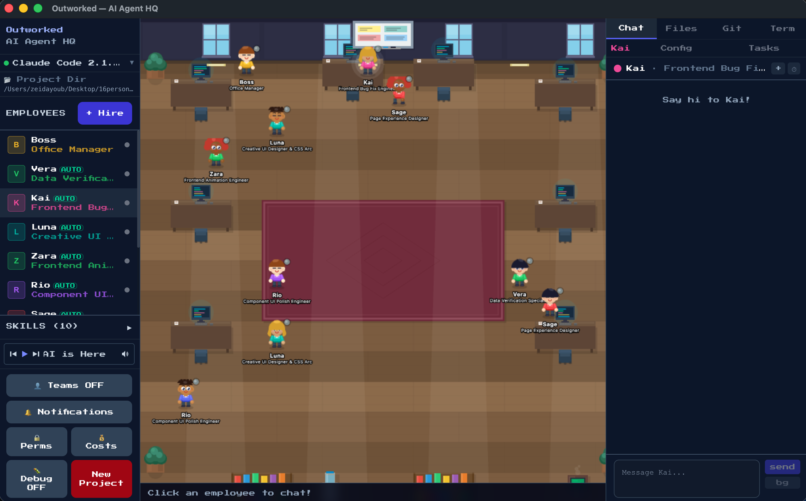

# Outworked

**AI agent orchestration with an 8-bit office GUI.**

Outworked turns AI agents into office employees you can see, click on, and manage. Think Animal Crossing meets Claude Code — a cute pixel-art office where each agent has a desk, a personality, and real tasks to do.



## Features

-   **Visual Office** — Phaser-powered 8-bit office where agents walk, sit, and collaborate in real time
-   **Agent Customization** — Give each agent a name, role, personality (system prompt), model, and sprite
-   **Task Orchestration** — Describe a goal; the router breaks it into tasks and assigns them to agents
-   **Claude Code Integration** — Agents run Claude Code sessions with full tool access (Bash, Edit, Read, etc.)
-   **Live Chat** — Markdown-rendered conversations with syntax-highlighted code blocks and diffs
-   **Git Panel** — View status, staged changes, branches, and create PRs without leaving the app
-   **File Browser** — Live-updating workspace tree that syncs as agents edit files
-   **Skills System** — Plug-in skills via `SKILL.md` files (GitHub, Whisper, Apple Notes, PDF, and more)
-   **Inter-Agent Messaging** — Agents collaborate using `[ASK:AgentName]` and a shared message bus
-   **Cost Dashboard** — Track tokens and spend per agent, session, and day
-   **Permissions & Safety** — Allowlists, working directory restrictions, timeouts, audit logging, and approval prompts for dangerous commands
-   **Desktop Notifications** — Get notified when tasks finish or agents need approval
-   **8-Bit Sound Effects** — Because every office needs a soundtrack

## Install

The easiest way to get started is to download the latest `.dmg` from [GitHub Releases](https://github.com/outworked/outworked/releases) and drag Outworked into your Applications folder.

### Prerequisites

-   [Claude Code](https://docs.anthropic.com/en/docs/claude-code) installed and authenticated

### From Source

```bash
# Requires Node.js v18+npm installnpm run electron:dev
```

On first launch, the onboarding modal will walk you through picking a workspace and creating your first agent.

## Scripts

Command

Description

`npm run dev`

Start Vite dev server (browser only, no Electron)

`npm run electron:dev`

Build and launch the full Electron app

`npm run electron:build`

Package distributable (dmg/zip on macOS, exe on Windows, AppImage on Linux)

## Tech Stack

Layer

Technology

Desktop

Electron

Frontend

React 19 + TypeScript + Tailwind CSS

Build

Vite

Graphics

Phaser 3

AI

Claude Code

## Project Structure

```
src/├── components/       # React UI (ChatWindow, OfficeCanvas, GitPanel, etc.)├── lib/              # Core logic (AI, orchestration, terminal, storage, costs)├── basic-skills/     # Bundled SKILL.md modules (github, whisper, etc.)└── phaser/           # Phaser game scene and sprite logicelectron/├── main.js           # Electron main process (IPC, shell, permissions)└── preload.js        # Context bridge to rendererpublic/├── sprites/          # 8-bit character sprite sheets├── backgrounds/      # Office background art└── music/            # Background music tracks
```

## Skills

Outworked uses a `SKILL.md` format — markdown files with YAML frontmatter that define what an agent can do. Bundled skills include:

-   **github** — GitHub API access
-   **openai-whisper** — Voice transcription
-   **apple-notes** / **apple-reminders** — macOS native app integration
-   **nano-pdf** — PDF reading and extraction
-   **mcporter** — MCP server support

You can create custom skills and assign them per-agent.

## Safety Model

Outworked takes a defense-in-depth approach:

1.  Explicit approval required before dangerous commands (deletes, installs, network changes)
2.  Allowlist / blocklist for permitted shell commands
3.  Working directory restrictions
4.  Configurable timeouts on long-running tasks
5.  Full audit trail and logging
6.  Agents produce a plan before execution
7.  Permissions dashboard for reviewing and managing access

## License

[GPL-3.0](LICENSE)